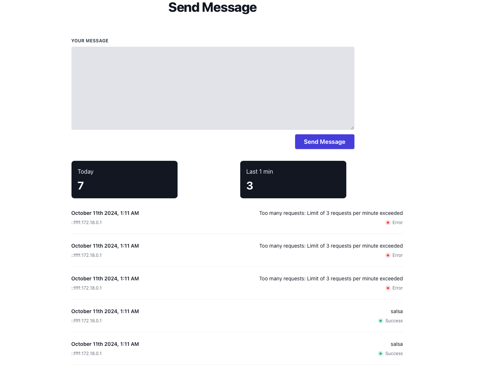

## SMS Rate Limiter

This project implements an API rate limiter for an SMS API that is called frequently from mobile devices. It ensures that the API is not overwhelmed by limiting the number of requests a client (identified by IP and phone number) can make in a certain time window. Additionally, a React-based dashboard is provided to monitor API usage, rate limit violations, and SMS statistics.

Video: https://www.loom.com/share/7e03ff166b6542318cf2dd29047a88db?sid=c890e064-796a-4e14-9eb4-e01eb619fc30




## API

1. Send SMS API
```bash
Endpoint:

http://localhost:3000/api/rate

body: 

{
 "phoneNumber":"11190",
  "message":"Hello every one"
}
```

2. Get Stats API

```bash
Endpoint: 

http://localhost:3000/api/stats?phoneNumber=12345678901
```


## Approach


### 1. Rate Limiting

Rate limiting is implemented using Redis to store and track the number of SMS requests made by a client (identified by their IP address and phone number) over a given time window.

The rate limiting middleware checks and updates the Redis counters for the client’s IP and phone number before allowing the request to proceed.


```js
rateRouter.route("/").post(rateLimit, sendSms)
```


### 2. Logs

Used PostgreSQL to store SMS logs, including the IP address, phone number, message, status (e.g., sent, failed), and timestamp.


## React Dashboard

The React dashboard provides a simple interface to monitor SMS usage and rate limit violations. The API data is fetched from the /stats endpoints.

## Instructions to set up and run the system locally.

Don't change any file, as ts compilation is happening locally

.env file is also included

1. Clone the repo
2. run `docker-compose up --build`

API endpoint: http://localhost:3000

Dashboard: http://localhost:3001